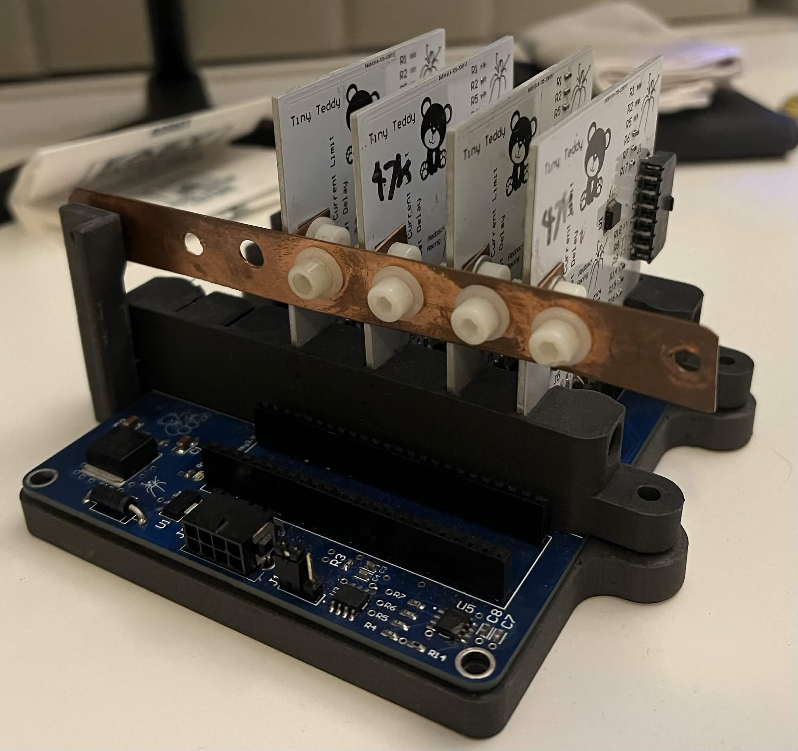
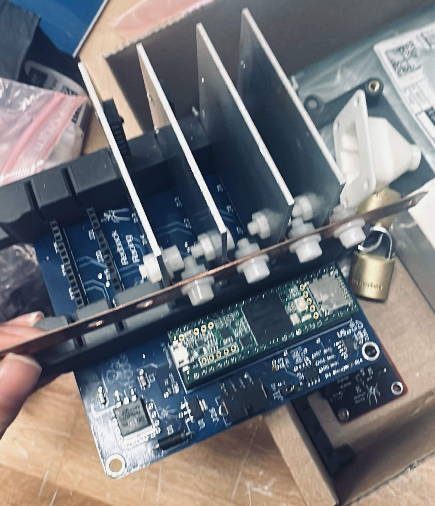
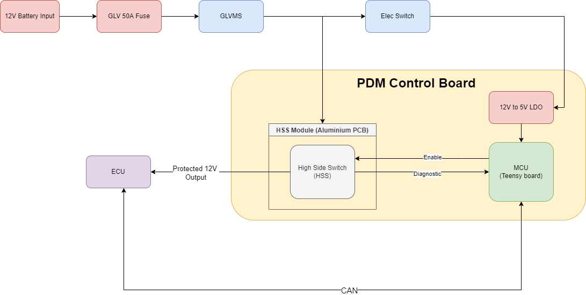
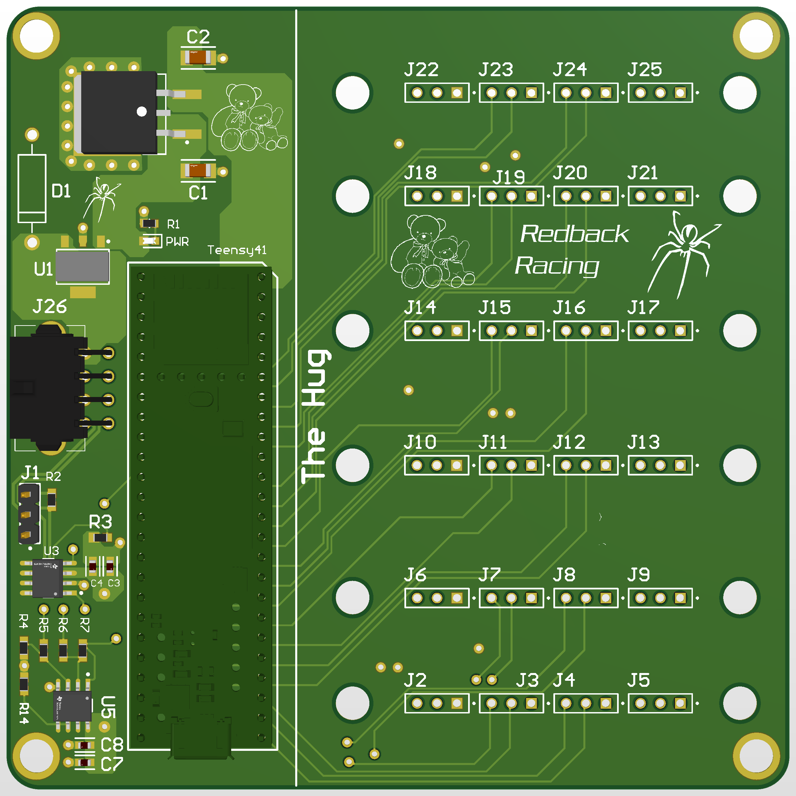
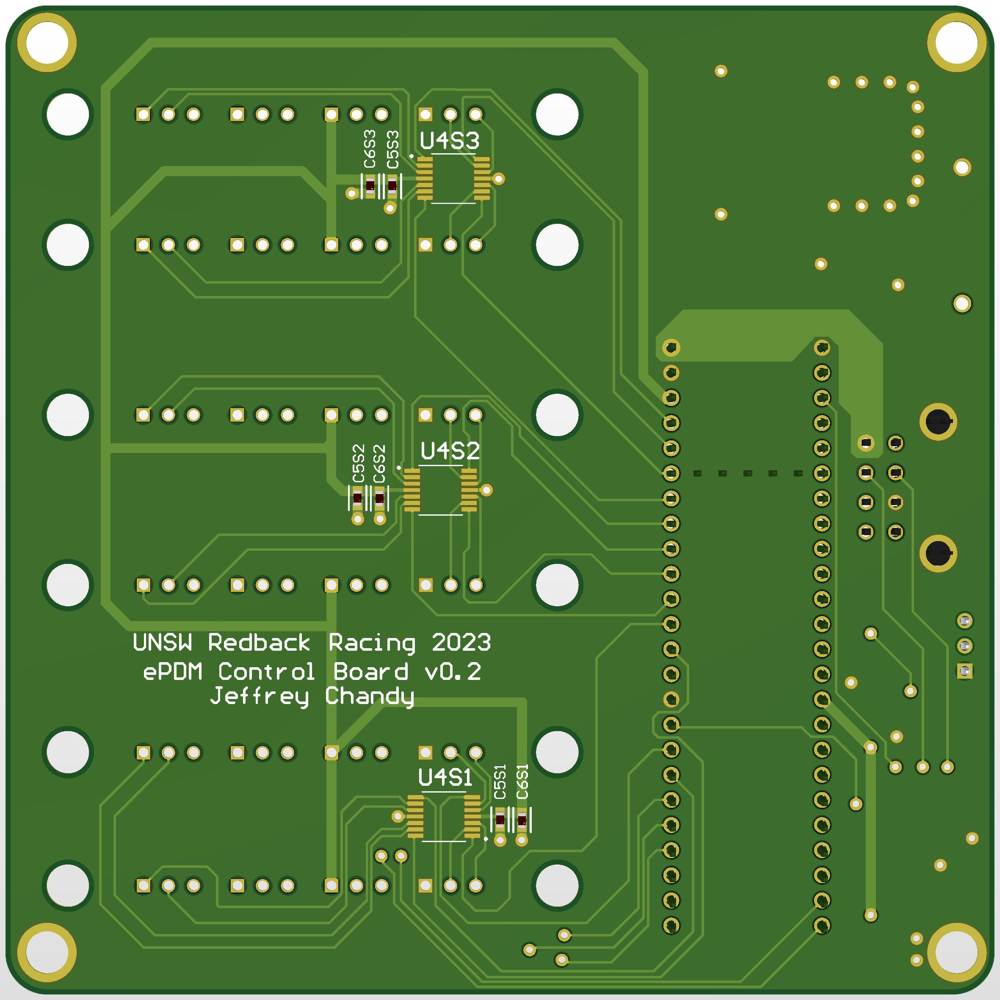
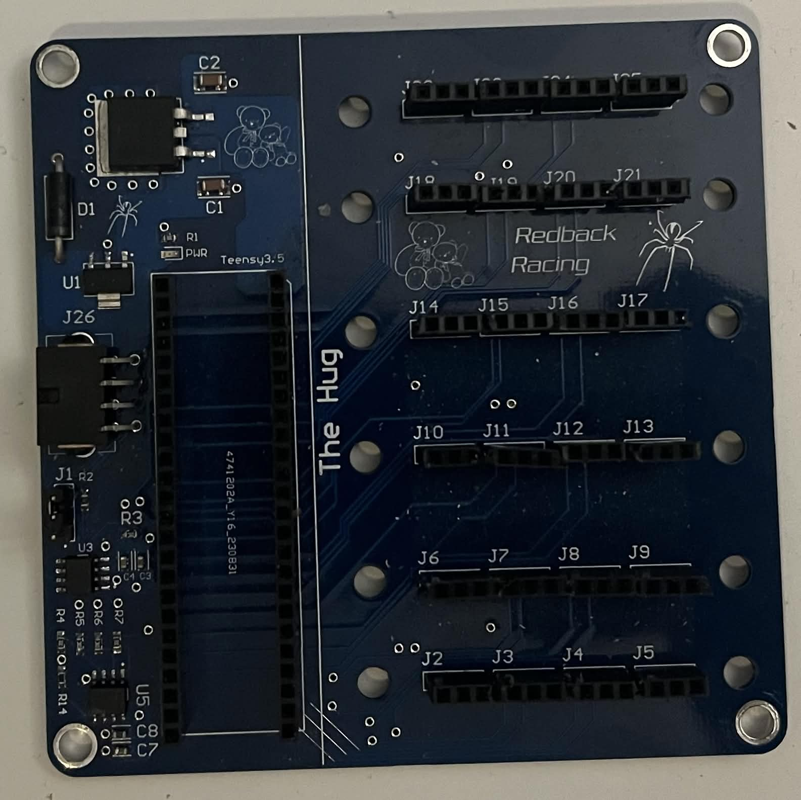
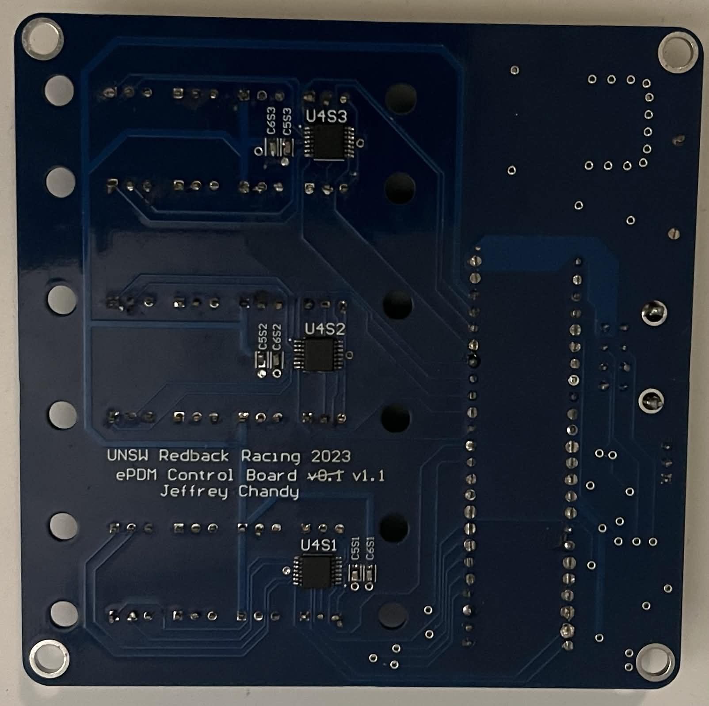
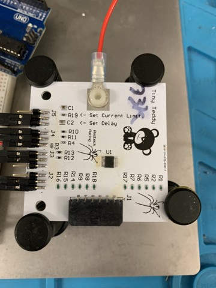

# Electronic Power Distribution Module (ePDM)

### Overview
The ePDM is a compact (100mm x 100mm x 60mm), lightweight power distribution system that replaces traditional electromechanical relays and fuses with high-side switches (HSS/e-fuses). It enables electronic control, current monitoring, fault detection, and CAN communication.

*Isometric view of assembled PDM system*

Its modular architecture allows individual power stages (HSS modules) to be independently replaced or scaled. The system supports up to 12 loads (6 modules, 2 channels each) and can be easily expanded as needed.

*Top view of assembled PDM system*

### High-Level Block Diagram

The system separates high-current (HSS module) and low-current (control board) functions, enabling greater design flexibility and more cost-effective solutions where thermal optimisation for high-current loads is not required. An external inline fuse is recommended upstream of the ePDM to protect against short circuits occurring before the module.

---
### Control Board

*Top view 3D render of the PCB*

The control board is a four-layer PCB that integrates 12V–5V power conversion circuitry, a Teensy microcontroller, a CAN communication interface, and current sensing circuitry. It can measure both the output current supplied to individual loads and the input current to the ePDM. Input current measurement requires a suitable external current transducer, such as the HO 50-S-0100.

*Bottom view 3D render of the PCB*

The board is designed to house 6 HSS modules and can be easily scaled to support more, at the cost of increased PCB size and weight.

*Top view of soldered PCB*

*Bottom view of soldered PCB*

---

### HSS Module

The HSS module is a single-layer aluminium PCB that forms the high-current path, hosting the high-side switch IC, associated passives, and current sense resistors. The voltage drop across these resistors is measured by the control board to monitor load current.

Aluminium PCBs provide a cost-effective alternative to high–copper-weight boards for thermal management, though they are limited to single-layer designs without through-hole components. As a result, the circuit is kept simple and optimised for power switching.

Each module is configurable, allowing adjustment of current limits, fault response timing, and sense resistor selection to suit the application. A single board supports up to 10 A and includes two independent channels for driving separate loads.

*Soldered HSS module*

---
